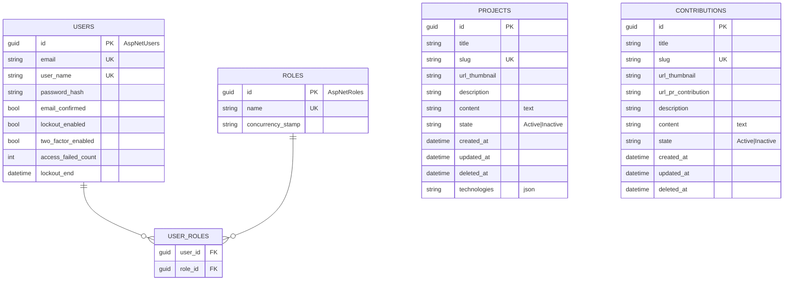

```mermaid
erDiagram
	USERS {
		guid id PK "AspNetUsers"
		string email UK
		string user_name UK
		string password_hash
		bool email_confirmed
		bool lockout_enabled
		bool two_factor_enabled
		int access_failed_count
		datetime lockout_end
	}

	ROLES {
		guid id PK "AspNetRoles"
		string name UK
		string concurrency_stamp
	}

	USER_ROLES {
		guid user_id FK
		guid role_id FK
	}

	PROJECTS {
		guid id PK
		string title
		string slug UK
		string url_thumbnail
		string description
		string content "text"
		string state "Active|Inactive"
		datetime created_at
		datetime updated_at
		datetime deleted_at
		string technologies "json"
	}

	CONTRIBUTIONS {
		guid id PK
		string title
		string slug UK
		string url_thumbnail
		string url_pr_contribution
		string description
		string content "text"
		string state "Active|Inactive"
		datetime created_at
		datetime updated_at
		datetime deleted_at
	}

	USERS ||--o{ USER_ROLES : ""
	ROLES ||--o{ USER_ROLES : ""

	%% D1: No FK from Project/Contribution to User.
	%% Projects and Contributions are managed by admins but don't track the admin.
```
