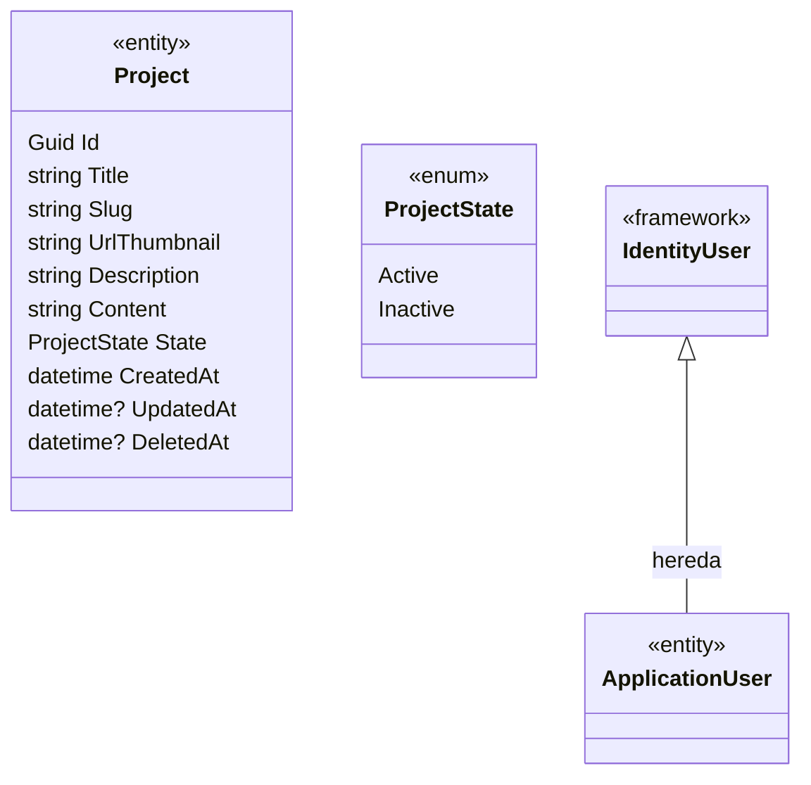

```mermaid
classDiagram
	class Project {
		<<entity>>
		Guid Id
		string Title
		string Slug
		string UrlThumbnail
		string Description
		string Content
		ProjectState State
		datetime CreatedAt
		datetime? UpdatedAt
		datetime? DeletedAt
	}
	
	class ProjectState {
		<<enum>>
		Active
		Inactive
	}
	
	class ApplicationUser {
		<<entity>>
	}
	
	IdentityUser <|-- ApplicationUser : hereda
	
	class IdentityUser {
		<<framework>>
	}
```
